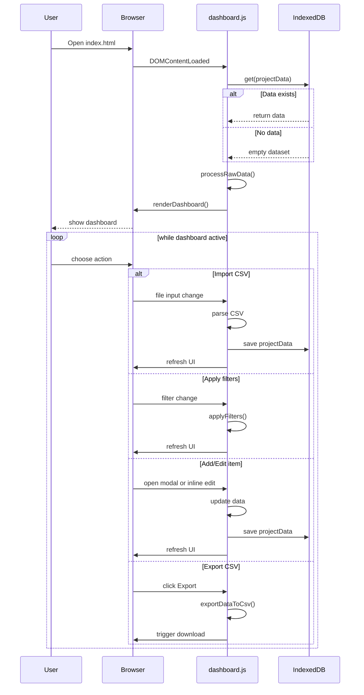

# Interactive Project Dashboard Specification

## Goal
As a Project Manager, I want a comprehensive dashboard to manage and visualize tasks, issues and milestones.

## Functional Requirements
- **KPIs Overview**: Show progress, task status, at‑risk items and upcoming milestones.
- **Gantt Chart**: Interactive view of project timeline with zooming, panning and baseline toggle.
- **Work Breakdown Table**: Editable task hierarchy with sorting and filtering.
- **Kanban Board**: Drag and drop tasks between statuses.
- **CSV Import/Export**: Support project data exchange in CSV format.
- **Item Management**: Add, edit and delete tasks, issues and milestones via forms.
- **Comments**: Add, import and export task comments for collaboration.
- **Custom Columns**: Toggle visibility and reorder columns in the task table.
- **Filtering**: Filter data by project, owner, status and date range.
- **Maintenance Tools**: Remove duplicate entries and reset all data.

## Interaction Flow

